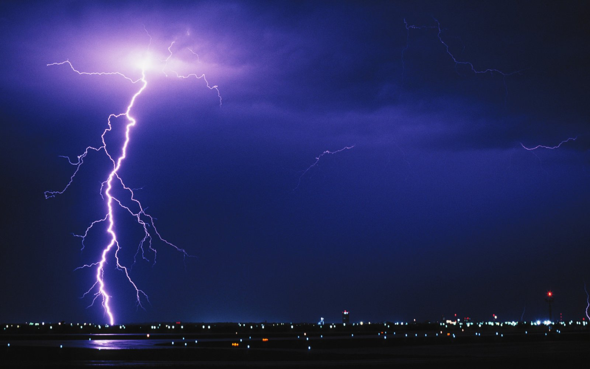
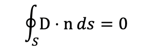
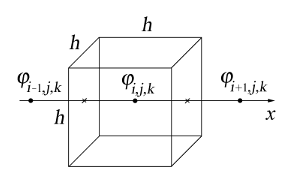
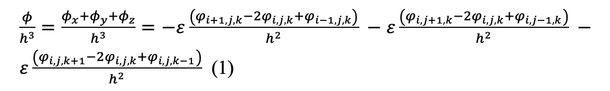
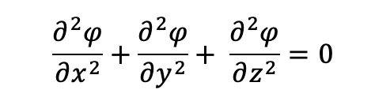
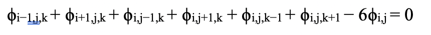
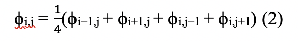

---
## Front matter
lang: ru-RU
title: Групповой проект. 1 этап
author: |
	 Астафьева Анна, Евдокимова Юлия, Жиронкин Павел, Коломиец Мария, Паландузян Артем, Сурнаков Александр\inst{1}
institute: |
	\inst{1}Российский Университет Дружбы народов, Москва, РФ
date: 26 Февраля, 2021, Москва, Россия

## Formatting
mainfont: PT Serif
romanfont: PT Serif
sansfont: PT Sans
monofont: PT Mono
toc: false
slide_level: 2
theme: metropolis
header-includes: 
 - \metroset{progressbar=frametitle,sectionpage=progressbar,numbering=fraction}
 - '\makeatletter'
 - '\beamer@ignorenonframefalse'
 - '\makeatother'
aspectratio: 43
section-titles: true

---
# Электрический пробой

## Введение

Человек познакомился с искровым разрядом задолго до того, как приступил к научному познанию мира. Феерическое и грозное явление природы — молния с точки зрения физики являет собой пример грандиозного искрового разряда в атмосфере. Началом систематического исследования электрического разряда можно считать экспериментальные исследования Б. Франклина в середине XVIII века, в которых было доказано единство природы молнии и лабораторной электрической искры.

## Терминология

1. Электрический разряд
2. Коронный разряд
3. Стримеры
4. Лидер
5. Электрический пробой

# Цели и задачи работы

## Цель работы

Изучение электрического пробоя, изучение механизма роста и ветвления стримеров и создание модели возникновения системы стримеров, наблюдаемых при искровом разряде в газах.
 
## Задачи работы

1. Вычисление электрического потенциала в однородном диэлектрике итерационным методом
2. Моделирование пробоя в геометрии «острие-плоскость» с использованием флуктуационного критерия роста
3. Изучение изменения густоты ветвей в зависимости от радиуса стримерной структуры электрического пробоя в геометрии «точка-окружность»
4. Реализация модели со степенной зависимостью вероятности роста от напряженности поля $\ p ~ Eη$ для случаев $η$ = 0, 1, 2.
Объект исследования: электрический пробой в однородном веществе
Предмет исследования: механизм роста и ветвления стримеров

# Процесс выполнения работы

## Теоретическое описание задачи

Интересной задачей является моделирование пробоя, ведь это очень красивое явление:

{ #fig:001 width=60% height=60% }

# Вычисление потенциала 
По теореме Гаусса поток вектора индукции электрического поля D через любую замкнутую поверхность S равен нулю при отсутствии внутри поверхности свободных электрических зарядов 

{ #fig:002 width=60% height=60% }

 ($n$ – вектор внешней нормали к поверхности)

## Вычисление потенциала 

{ #fig:003 width=70% height=70% }

## Вычисление потенциала 

{ #fig:008 width=40% height=60% }

{ #fig:004 width=70% height=60% }

Если записать поток поля через клетку и приравнять к нулю, то получится уравнение Лапласа:

{ #fig:005 width=50% height=50% }

## Вычисление потенциала 

Используя условие равенства нулю полного потока из уравнения (1) можно также получить уравнение

{ #fig:006 height=60% }

Далее будем рассматривать плоский случай

{ #fig:007 width=60% height=60% }

## Критерии роста

Электрический пробой — стохастический процесс, каждое звено может пробиваться с некоторой вероятностью, зависящей от поля. Такая зависимость называется критерием роста.  

1. Модель НПВ
2. Флуктуационный критерий роста
3. Модели стохастического времени запаздывания

# Выводы по проделанной работе

## Вывод

На основе проделанной работы изучили электрический пробой, изучили механизм роста и ветвления стримеров

## {.standout}

Спасибо за внимание!
