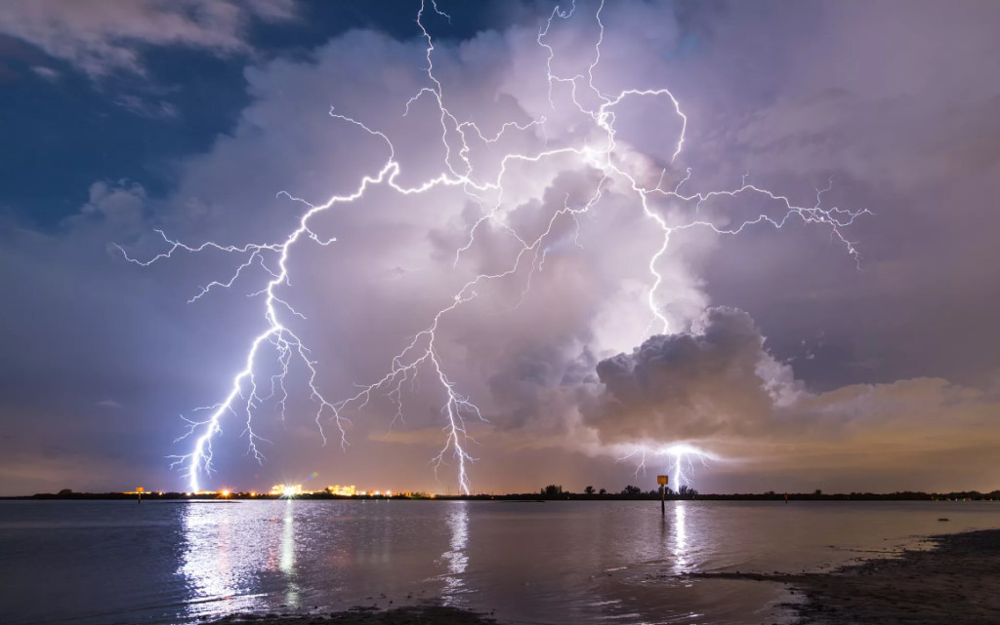

---
# Front matter
lang: ru-RU
title: "Проект на тему:"
subtitle: "Электрический пробой"
author: 
- "Астафьева Анна Андреевна"
- "Коломиец Мария Владимировна"
- "Жиронкин Павел Владимирович"
- "Паландузян Артем Карапетович"
- "Сурнаков Александр Васильевич"
- "Евдокимова Юлия Константиновна"
- "Группа: НПИбд-01-18"
# Formatting
toc-title: "Содержание"
toc: true # Table of contents
toc_depth: 2
lof: true # List of figures
lot: true # List of tables
fontsize: 12pt
linestretch: 1.5
papersize: a4paper
documentclass: scrreprt
polyglossia-lang: russian
polyglossia-otherlangs: english
mainfont: PT Serif
romanfont: PT Serif
sansfont: PT Sans
monofont: PT Mono
mainfontoptions: Ligatures=TeX
romanfontoptions: Ligatures=TeX
sansfontoptions: Ligatures=TeX,Scale=MatchLowercase
monofontoptions: Scale=MatchLowercase
indent: true
pdf-engine: lualatex
header-includes:
  - \linepenalty=10 # the penalty added to the badness of each line within a paragraph (no associated penalty node) Increasing the value makes tex try to have fewer lines in the paragraph.
  - \interlinepenalty=0 # value of the penalty (node) added after each line of a paragraph.
  - \hyphenpenalty=50 # the penalty for line breaking at an automatically inserted hyphen
  - \exhyphenpenalty=50 # the penalty for line breaking at an explicit hyphen
  - \binoppenalty=700 # the penalty for breaking a line at a binary operator
  - \relpenalty=500 # the penalty for breaking a line at a relation
  - \clubpenalty=150 # extra penalty for breaking after first line of a paragraph
  - \widowpenalty=150 # extra penalty for breaking before last line of a paragraph
  - \displaywidowpenalty=50 # extra penalty for breaking before last line before a display math
  - \brokenpenalty=100 # extra penalty for page breaking after a hyphenated line
  - \predisplaypenalty=10000 # penalty for breaking before a display
  - \postdisplaypenalty=0 # penalty for breaking after a display
  - \floatingpenalty = 20000 # penalty for splitting an insertion (can only be split footnote in standard LaTeX)
  - \raggedbottom # or \flushbottom
  - \usepackage{float} # keep figures where there are in the text
  - \floatplacement{figure}{H} # keep figures where there are in the text
---

# Введение

Человек познакомился с искровым разрядом задолго до того, как приступил к научному познанию мира. Феерическое и грозное явление природы — молния с точки зрения физики являет собой пример грандиозного искрового разряда в атмосфере. Началом систематического исследования электрического разряда можно считать экспериментальные исследования Б. Франклина в середине XVIII века, в которых было доказано единство природы молнии и лабораторной электрической искры.  

Возникновение искрового электрического разряда сильно зависит от условий эксперимента. В длинных искровых промежутках (когда расстояние между электродами составляет десятки сантиметров или даже метры) при постепенном увеличении напряжения между электродами вначале наблюдается коронный разряд. Коронный разряд наблюдается в виде синевато-фиолетового свечения на одном из электродов (катоде), охватывающего ту область электрода, где поле наиболее сильное, и затухающего по мере удаления от металлической поверхности. Корона возникает в основном в области неоднородного поля — возле металлических выступов, «заусенцев», любых неоднородностей на электродах.  

При напряжениях, более высоких, чем те, которые приводят к образованию короны, в газах возникают так называемые стримеры. Стримеры представляют собой систему слабосветящихся проводящих каналов, образующуюся в газе в области наиболее сильного электрического поля. Стример прорастает, как правило, с одного из электродов и при высоких напряжениях может ветвиться. Ветвление стримера происходит нерегулярно, и на сегодняшний день можно считать, что эти ветвления носят случайных характер. Разветвленную стримерную вспышку часто называют импульсной короной. Размер области, в которой развиваются стримеры, может составлять несколько метров даже в лабораторных условиях. Скорость продвижения стримера вглубь межэлектродного промежутка не меньше 10 км/с и может достигать 10000 км/с. Вспышкой импульсной короны начинается искровой разряд в воздухе или других газах в длинных промежутках между электродами. В случае пробоя в газах при определенных условиях энерговыделения в стримерных каналах они превращаются в так называемые лидерные каналы. Лидер — это плазменное образование очень высокой светимости и настолько высокой проводимости, что его в некотором смысле можно считать продолжением электрода. Скорость распространения лидера по порядку величины составляет 10 км/с. Перед головной частью лидера образуется стримерная корона, от которой зависит дальнейшая динамика лидерного канала.  

На сегодняшний день менее всего изучен механизм роста и ветвления стримеров при электрическом разряде. Согласно современным представлениям, рост кончика стримера определяется величиной напряженности электрического поля перед ним. Величина электрического поля зависит не только от падения напряжения между электродами, но и от радиуса стримера, и от скорости его роста. Эти три величины — радиус, локальная напряженность электрического поля и скорость роста кончика стримера работы — связаны между собой. При определенных значениях этих величин кончик стримера может разветвляться.

# Терминология

**Электрический разряд** -- это физический процесс, который характеризуется наличием потока заряженных частиц между двумя пространственными областями, имеющими разный потенциал в газовой среде.  

**Коронный разряд** -- это самостоятельный газовый разряд, возникающий в резко неоднородных полях у электродов с большой кривизной поверхности (острия, тонкие провода).  

**Стримеры** - система слабосветящихся проводящих каналов, образующуюся в газе в области наиболее сильного электрического поля.

**Импульсная корона** –- разветвленная стримерная вспышка.  

**Лидер** -- это плазменное образование очень высокой светимости и настолько высокой проводимости, что его в некотором смысле можно считать продолжением электрода.

**Электрический пробой** -- явление резкого возрастания тока в твёрдом, жидком или газообразном диэлектрике (или полупроводнике) или воздухе, возникающее при приложении напряжения выше критического (напряжение пробоя).  

# Цели и задачи

**Цель работы:** изучение электрического пробоя, изучен механизм роста и ветвления стримеров и создание модели возникновения системы стримеров, наблюдаемых при искровом разряде в газах.  

**Задачи:**  
1. Вычисление электрического потенциала в однородном диэлектрике итерационным методом  
2. Моделирование пробоя в геометрии «острие-плоскость» с использованием флуктуационного критерия роста  
3. Изучение изменения густоты ветвей в зависимости от радиуса стримерной структуры электрического пробоя в геометрии «точка-окружность»  
4.	Реализация модели со степенной зависимостью вероятности роста от напряженности поля $\ p ~  E η$ для случаев не $η$ = 0, 1, 2.  
  
**Объект исследования:** электрический пробой в однородном веществе.  
  
**Предмет исследования:** механизм роста и ветвления стримеров.  

# Теоретическое описание задачи

Интересной задачей является моделирование пробоя, ведь это очень красивое явление (рис. -@fig:001): 

{ #fig:001 width=70% }

## Вычисление потенциала

Рассмотрим простейший случай — вещество однородно (диэлектрическая проницаемость среды $ε$ везде одинакова), и первоначально в нем нет свободных зарядов.  

По теореме Гаусса поток вектора индукции электрического поля D через любую замкнутую поверхность S равен нулю при отсутствии внутри поверхности свободных электрических зарядов (см. рис. -@fig:002).

{ #fig:002 width=70% }

(n – вектор внешней нормали к поверхности).  
 
Для большинства диэлектриков индукция электрического поля выражается через электрическое поле как D = $ε$E. В общем случае вектор E имеет три компоненты (E~x~, E~y~, E~z~).  
  
Рассмотрим в пространстве кубическую решетку с ячейками со сторонами h по всем координатам ∆x = h, ∆y = h и ∆z = h. Сначала рассмотрим только один ряд ячеек вдоль оси x (рис. -@fig:003). Пусть электрический потенциал принимает в центре i-той ячейки значение $ϕ$~i,j,k~.

{ #fig:003 width=70% }

Вычислим полный поток изнутри ячейки и
поделим его на объем ячейки (рис. -@fig:004).

{ #fig:004 width=70% }

Если записать поток поля через клетку и приравнять к нулю, то получится уравнение Лапласа (рис. -@fig:005).

{ #fig:005 width=70% }

Используя условие равенства нулю полного потока из уравнения (1) можно также получить уравнение (см. рис. -@fig:006).  

{ #fig:006 width=70% }

Далее будем рассматривать плоский случай. Потенциал изменяется только в плоскости XY , поэтому по теореме Гаусса для квадратной ячейки сетки с номером i, j  получим (см. рис. -@fig:007).  

{ #fig:007 width=70% }

Теперь можно итеративно просчитывать потенциал для всей решётки. Зная потенциал, можно вычислить электрическое поле.

## Критерии роста

Осталось придумать правило для роста так называемого стримера.  

**Электрический пробой** — стохастический процесс, каждое звено может пробиваться с некоторой вероятностью, зависящей от поля. Такая зависимость называется **критерием роста**. Рассмотрим некоторые примеры:  

- Модель НТП  
- Флуктуационный критерий роста  
- Модели стохастического времени запаздывания  

### Модель НТП

Один из самых простых критериев роста - модель НПВ: Нимейером, Пьетронеро и Висманом впервые была предложена модель, которая позволяет описать рост структур разряда в диэлектриках. В основе модели лежит предположение, что структура растет случайным образом, причем вероятность роста зависит только от локального электрического поля вблизи структуры.  

Рост начинается с одной из точек на электроде. На каждом шаге роста с некоторой вероятностью может образоваться одна веточка разрядной структуры. Эта веточка будет соединять два соседних узла сетки, один из которых уже принадлежит разрядной структуре, а другой является «диэлектриком». Таким образом, из каждого узла двумерной сетки может образоваться до восьми веточек, если учитывать возможность роста и по диагоналям (для трехмерной сетки до 26 веточек).  

Такая модель роста принадлежит к классу однозвенных моделей, в которых считается, что проводящее звено, появившееся первым, подавляет рост остальных на текущем временном шаге.  

### Флуктуационный критерий роста  

В многозвенных моделях, наоборот, пренебрегается влиянием друг на друга проводящих звеньев, возникающих на данном шаге по времени. Пусть пробой происходит в областях диэлектрика, где величина поля превосходит некоторое пороговое значение $E∗$ (электрическую прочность).  

### Модели стохастического времени запаздывания  

Для каждого возможного звена было введено случайное время ожидания пробоя. В однозвенной модели пробивается звено, у которого время минимально. Шаг роста во времени принимается равным этому минимальному значению.  

В многозвенной модели пробиваются все звенья, для которых это время меньше заданного шага по времени ∆t, который можно выбрать постоянным.

# Вывод

На основе проделанной работы мы изучили электрический пробой, изучили механизм роста и ветвления стримеров.  
Описано вычисление потенциала и модели разных критериев роста.

# Список литературы

  
1. Д. А. Медведев, А. Л. Куперштох, Э. Р. Прууэл, Н. П. Сатонкина, Д. И. Карпов - МОДЕЛИ-РОВАНИЕ ФИЗИЧЕСКИХ ПРОЦЕССОВ И ЯВЛЕНИЙ НА ПК  

2. Niemeyer L., Pietronero L., Wiesmann H. J. Fractal dimension of dielectric breakdown // Physical Review Letters. 1984. V. 52, N 12.
P. 1033–1036  

3. Biller P. Fractal streamer models with physical time // Proc. 11th
Int. Conf. on Conduction and Breakdown in Dielectric Liquids, IEEE
N 93CH3204-5. Baden-D¨attwil, Switzerland, 1993. P. 199–203.  
