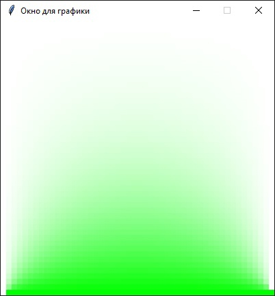
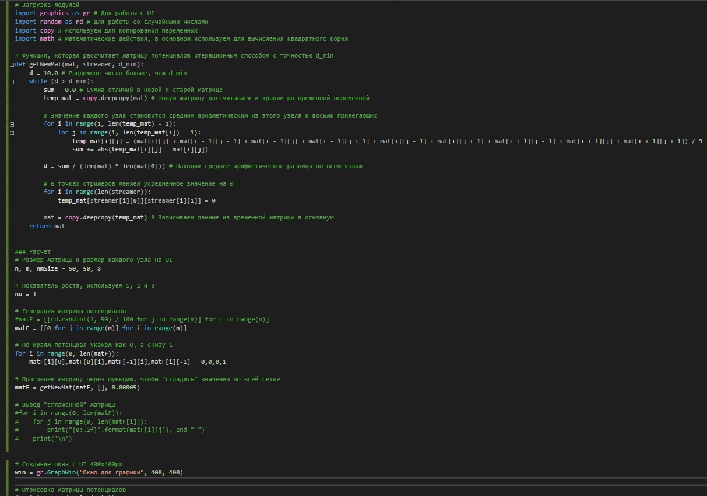
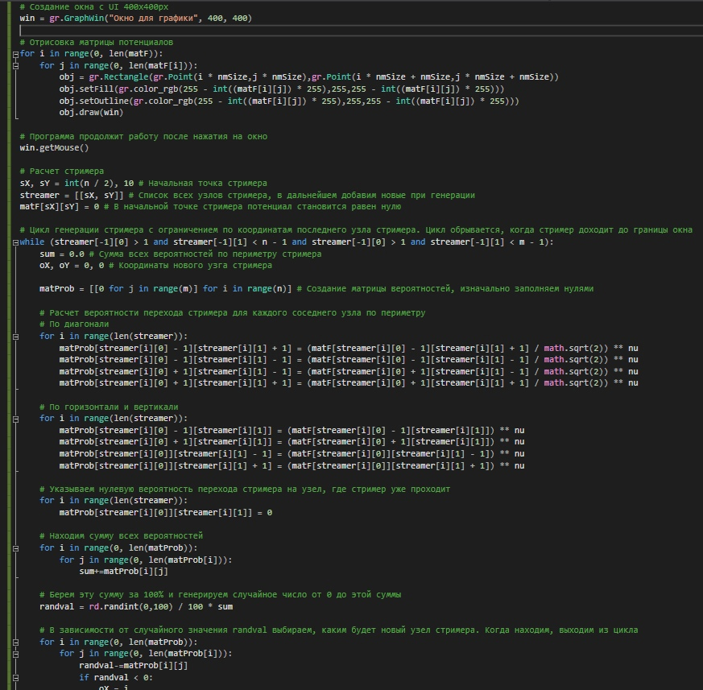
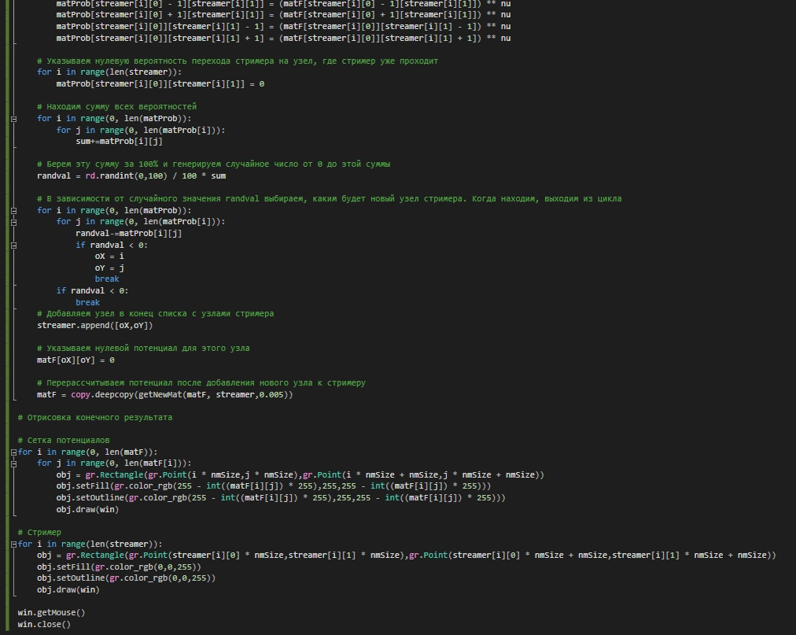
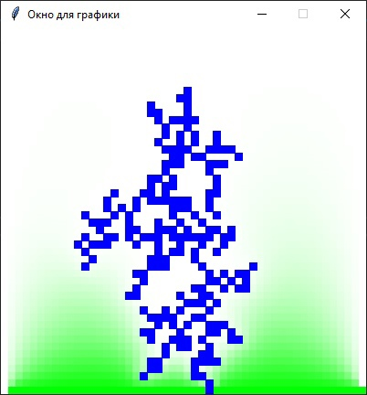
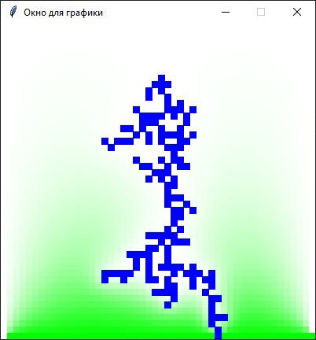
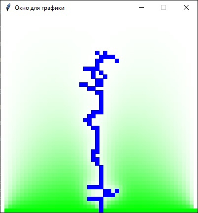

---
## Front matter
lang: ru-RU
title: Групповой проект. 3 этап
author: |
	 Астафьева Анна, Евдокимова Юлия, Жиронкин Павел, Коломиец Мария, Паландузян Артем, Сурнаков Александр\inst{1}
institute: |
	\inst{1}Российский Университет Дружбы народов, Москва, РФ
date: 6 Марта, 2021, Москва, Россия

## Formatting
mainfont: PT Serif
romanfont: PT Serif
sansfont: PT Sans
monofont: PT Mono
toc: false
slide_level: 2
theme: metropolis
header-includes: 
 - \metroset{progressbar=frametitle,sectionpage=progressbar,numbering=fraction}
 - '\makeatletter'
 - '\beamer@ignorenonframefalse'
 - '\makeatother'
aspectratio: 43
section-titles: true

---
# Электрический пробой. Программа

# Цели и задачи работы

## Цель работы

Реализация программы по алгоритму, сотавленному на прошлом этапе для моделирования роста стримерной структуры при электрическом пробое.
 
## Задачи работы

1. Реализовать в геометрии «острие – плоскость» однозвенную модель со степенной зависимостью вероятности роста от напряженности поля $\ p ~ E^η$. 
2. Рассмотреть изменение геометрии стримерной структуры для случаев $η$ = 1, 2, 3. 

# Реализация алгоритма в программе

## Вычисление потенциала 
1. Задаем квадратную сетку 50х50 в качесте области моделирования:  
  
*# Размер матрицы и размер каждого узла на UI*  
*n, m, nmSize = 50, 50, 8*  

2. Задаем произвольные значения потенциала для внутренних узлов области:  
  
*# Генерация матрицы потенциалов*  
*#matF = [[rd.randint(1, 50) / 100 for j in range(m)] for i in range(n)]*  
*matF = [[0 for j in range(m)] for i in range(n)]*  

## Вычисление потенциала 

3. Узлам, примыкающим к границе, задаем значение потенциала, равное значению потенциала границы (0 для верхней границы, 1 для нижней для простоты вычислений):  
  
*# По краям потенциал укажем как 0, а снизу 1*  
*for i in range(0, len(matF)):*  
$\>$ *matF[i][0],matF[0][i],matF[-1][i],matF[i][-1] = 0,0,0,1*  

4. Вычисляем новые значения потенциала во всех узлах.  
Для вычисления потенциала мы используем формулу:  

$$ϕ_{i,j} = \frac{1}{4}(ϕ_{i-1,j} + ϕ_{i+1,j} + ϕ_{i,j-1} + ϕ_{i,j+1})$$

## Вычисление потенциала 

И итерационно просчитываем потенциал для каждого узла сетки (рис. -@fig:000):  

{ #fig:000 width=50% hight=50%}  

5. Повторяем пункт 4. пока потенциалы не перестанут изменяться.  

## Вычисление потенциала 

В результате получаем потенциал (рис. -@fig:001):  

{ #fig:001 width=30% hight=30%} 

## Рост структур разряда по модели НПВ

1. Пробиваем первый узел:  
  
*sX, sY = int(n / 2), 10 # Начальная точка стримера*  

2. Пробегаем по всем узлам, в которые возможем рост и считаем сумму вероятностей роста по формуле:  

$$Z = \sum _{k=1}^M E_k^η$$  
Здесь $|E| = ϕ_B$ (для горизонтальных и вертикальных звеньев),   
$|E| = ϕ_B$/&radic;2 (для диагональных).  

*# Находим сумму всех вероятностей*  
$\>$ *for i in range(0, len(matProb)):*  
$\>$ $\>$ *for j in range(0, len(matProb[i])):*  
$\>$ $\>$ $\>$ *sum+=matProb[i][j]*  

## Рост структур разряда по модели НПВ

3. Разыгрываем случайное число $ξ$, равномерно распределенное от 0 до Z:  
  
*# Берем эту сумму за 100% и генерируем случайное число от 0 до этой суммы*  
$\>$ *randval = rd.randint(0,100) / 100 $*$ sum*  

## Рост структур разряда по модели НПВ

4. Затем повторно шаг за шагом рассчитывается сумма до тех пор, пока текущая сумма не станет больше $ξ$. Тот узел, для которого сумма стала больше $ξ$, присоединяется к структуре (рис. -@fig:012):  

{ #fig:012 width=70% }   

## Рост структур разряда по модели НПВ

5. Пересчитываем поле (п. 4-5):  
  
*# Перерассчитываем потенциал после добавления нового узла к стримеру*  
$\>$ *matF = copy.deepcopy(getNewMat(matF, streamer,0.005))*  
  
6. Повторяем пункты 2-5, пока узор не достигнет границы.

## Программа

{ #fig:002 width=70% } 

## Программа

{ #fig:003 width=70% } 

## Программа

{ #fig:004 width=70% } 

# Результат работы программы

## 1. $η = 1$ (рис. -@fig:006):  

{ #fig:006 width=50% hight=50%} 

## 2. $η = 2$ (рис. -@fig:009):  

{ #fig:009 width=50% hight=50%} 

## 3. $η = 3$ (рис. -@fig:010):  

{ #fig:010 width=50% hight=50%} 

## 4. $η = 4$ (рис. -@fig:011):  

{ #fig:011 width=50% hight=50%} 

# Выводы по проделанной работе

## Вывод

Написана программа реализующая в геометрии «острие – плоскость» однозвенную модель со степенной зависимостью вероятности роста от напряженности поля $p$ ~ $E^η$.  
  
Рассмотренно изменение геометрии стримерной структуры для случаев $η$ = 1, 2, 3, 4: при увеличении $η$ уменьшается ветвистость стримерной структуры.

## {.standout}

Спасибо за внимание!
