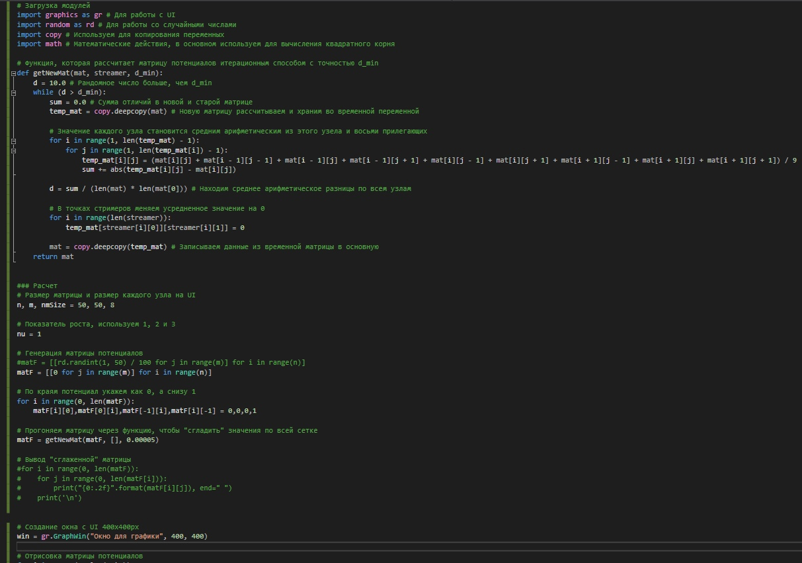
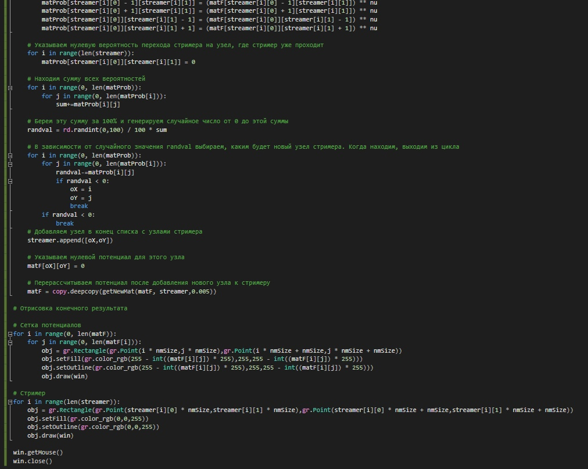
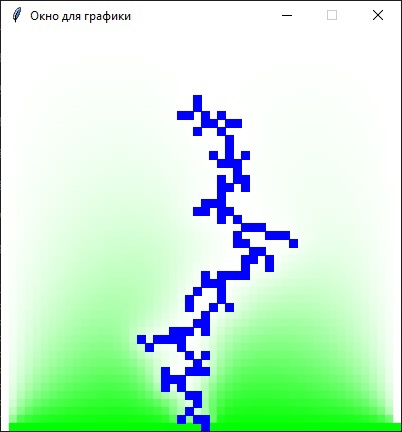
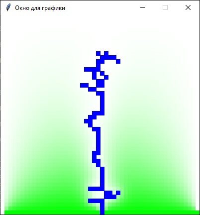

---
# Front matter
lang: ru-RU
title: "Групповой проект. 3 этап"
subtitle: "Электрический пробой. Программа"
author: 
- "Астафьева Анна Андреевна"
- "Коломиец Мария Владимировна"
- "Жиронкин Павел Владимирович"
- "Паландузян Артем Карапетович"
- "Сурнаков Александр Васильевич"
- "Евдокимова Юлия Константиновна"
- "Группа: НПИбд-01-18"
# Formatting
toc-title: "Содержание"
toc: true # Table of contents
toc_depth: 2
lof: true # List of figures
lot: true # List of tables
fontsize: 12pt
linestretch: 1.5
papersize: a4paper
documentclass: scrreprt
polyglossia-lang: russian
polyglossia-otherlangs: english
mainfont: PT Serif
romanfont: PT Serif
sansfont: PT Sans
monofont: PT Mono
mainfontoptions: Ligatures=TeX
romanfontoptions: Ligatures=TeX
sansfontoptions: Ligatures=TeX,Scale=MatchLowercase
monofontoptions: Scale=MatchLowercase
indent: true
pdf-engine: lualatex
header-includes:
  - \linepenalty=10 # the penalty added to the badness of each line within a paragraph (no associated penalty node) Increasing the value makes tex try to have fewer lines in the paragraph.
  - \interlinepenalty=0 # value of the penalty (node) added after each line of a paragraph.
  - \hyphenpenalty=50 # the penalty for line breaking at an automatically inserted hyphen
  - \exhyphenpenalty=50 # the penalty for line breaking at an explicit hyphen
  - \binoppenalty=700 # the penalty for breaking a line at a binary operator
  - \relpenalty=500 # the penalty for breaking a line at a relation
  - \clubpenalty=150 # extra penalty for breaking after first line of a paragraph
  - \widowpenalty=150 # extra penalty for breaking before last line of a paragraph
  - \displaywidowpenalty=50 # extra penalty for breaking before last line before a display math
  - \brokenpenalty=100 # extra penalty for page breaking after a hyphenated line
  - \predisplaypenalty=10000 # penalty for breaking before a display
  - \postdisplaypenalty=0 # penalty for breaking after a display
  - \floatingpenalty = 20000 # penalty for splitting an insertion (can only be split footnote in standard LaTeX)
  - \raggedbottom # or \flushbottom
  - \usepackage{float} # keep figures where there are in the text
  - \floatplacement{figure}{H} # keep figures where there are in the text
---

# Цели и задачи

**Цель работы:** реализация программы по алгоритму, сотавленному на прошлом этапе для моделирования роста стримерной структуры при электрическом пробое.

**Задачи:**  

1. Реализовать в геометрии «острие – плоскость» однозвенную модель со степенной зависимостью вероятности роста от напряженности поля $p$ ~ $E^η$.
2. Рассмотреть изменение геометрии стримерной структуры для случаев $η$ = 0, 1, 2. 
  

# Реализация алгоритма в программе

Реализовывать алгоритм мы решили на языке Python, с использованием графического модуля graphicps для наглядного изображения пробоя.

## Вычисление потенциала 

1. Задаем квадратную сетку 50х50 в качесте области моделирования:  
  
*# Размер матрицы и размер каждого узла на UI*  
*n, m, nmSize = 50, 50, 8*  

2. Задаем произвольные значения потенциала для внутренних узлов области:  
  
*# Генерация матрицы потенциалов*  
*#matF = [[rd.randint(1, 50) / 100 for j in range(m)] for i in range(n)]*  
*matF = [[0 for j in range(m)] for i in range(n)]*  

3. Узлам, примыкающим к границе, задаем значение потенциала, равное значению потенциала границы (0 для верхней границы, 1 для нижней для простоты вычислений):  
  
*# По краям потенциал укажем как 0, а снизу 1*  
*for i in range(0, len(matF)):*  
$\>$ *matF[i][0],matF[0][i],matF[-1][i],matF[i][-1] = 0,0,0,1*  

4. Вычисляем новые значения потенциала во всех узлах.  
Для вычисления потенциала мы используем формулу:  

$$ϕ_{i,j} = \frac{1}{4}(ϕ_{i-1,j} + ϕ_{i+1,j} + ϕ_{i,j-1} + ϕ_{i,j+1})$$

И итерационно просчитываем потенциал для каждого узла сетки (рис. -@fig:000):  

{ #fig:000 width=70% }  

5. Повторяем пункт 4. пока потенциалы не перестанут изменяться.  

В результате получаем потенциал (рис. -@fig:001):  

{ #fig:001 width=30% hight=30%} 
 

Посчитав потенциал поля перейдем к моделированию разряда по модели НПВ.

1. Пробиваем первый узел:  
  
*sX, sY = int(n / 2), 10 # Начальная точка стримера*  

2. Пробегаем по всем узлам, в которые возможем рост и считаем сумму вероятностей роста по формуле:  

$$Z = \sum _{k=1}^M E_k^η$$  
Здесь $|E| = ϕ_B$ (для горизонтальных и вертикальных звеньев),   
$|E| = ϕ_B$/&radic;2 (для диагональных).  

*# Находим сумму всех вероятностей*  
$\>$ *for i in range(0, len(matProb)):*  
$\>$ $\>$ *for j in range(0, len(matProb[i])):*  
$\>$ $\>$ $\>$ *sum+=matProb[i][j]*  

3. Разыгрываем случайное число $ξ$, равномерно распределенное от 0 до Z:  
  
*# Берем эту сумму за 100% и генерируем случайное число от 0 до этой суммы*  
$\>$ *randval = rd.randint(0,100) / 100 $*$ sum*  

4. Затем повторно шаг за шагом рассчитывается сумма до тех пор, пока текущая сумма не станет больше $ξ$. Тот узел, для которого сумма стала больше $ξ$, присоединяется к структуре (рис. -@fig:012):  

{ #fig:012 width=70% }   

5. Пересчитываем поле (п. 4-5):  
  
*# Перерассчитываем потенциал после добавления нового узла к стримеру*  
$\>$ *matF = copy.deepcopy(getNewMat(matF, streamer,0.005))*  
  
6. Повторяем пункты 2-5, пока узор не достигнет границы.

## Программа

В итоге мы получили программу (рис. -@fig:002, -@fig:003, -@fig:004):  

{ #fig:002 width=70% } 

{ #fig:003 width=70% } 

{ #fig:004 width=70% } 

## Результат работы программы

При вероятности с показателем роста $η=1$:  
$p$ ~ $E$  
Получаем стримерную структуру (рис. -@fig:005):  

{ #fig:005 width=50% hight=50%} 
 
## Изменение геометрии стримерной структуры в зависимости от показателя роста $η$

Рассмотрим изменения стримерной структуры при увеличении показателя роста $η$.

### 1. $η = 1$ (рис. -@fig:006, -@fig:007, -@fig:007):  

{ #fig:006 width=50% hight=50%} 

{ #fig:007 width=50% hight=50%} 

{ #fig:008 width=50% hight=50%} 

### 2. $η = 2$ (рис. -@fig:009):  

{ #fig:009 width=50% hight=50%} 

### 3. $η = 3$ (рис. -@fig:010):  

{ #fig:010 width=50% hight=50%} 

### 4. $η = 4$ (рис. -@fig:011):  

{ #fig:011 width=50% hight=50%} 
  
При увеличении $η$ уменьшается ветвистость стримерной структуры.

# Вывод

Написана программа реализующая в геометрии «острие – плоскость» однозвенную модель со степенной зависимостью вероятности роста от напряженности поля $p$ ~ $E^η$.  
  
Рассмотренно изменение геометрии стримерной структуры для случаев $η$ = 1, 2, 3, 4: при увеличении $η$ уменьшается ветвистость стримерной структуры.

# Список литературы

  
1. Д. А. Медведев, А. Л. Куперштох, Э. Р. Прууэл, Н. П. Сатонкина, Д. И. Карпов - МОДЕЛИ-РОВАНИЕ ФИЗИЧЕСКИХ ПРОЦЕССОВ И ЯВЛЕНИЙ НА ПК  

2. Niemeyer L., Pietronero L., Wiesmann H. J. Fractal dimension of dielectric breakdown // Physical Review Letters. 1984. V. 52, N 12.
P. 1033–1036  

3. Biller P. Fractal streamer models with physical time // Proc. 11th
Int. Conf. on Conduction and Breakdown in Dielectric Liquids, IEEE
N 93CH3204-5. Baden-D¨attwil, Switzerland, 1993. P. 199–203.  
