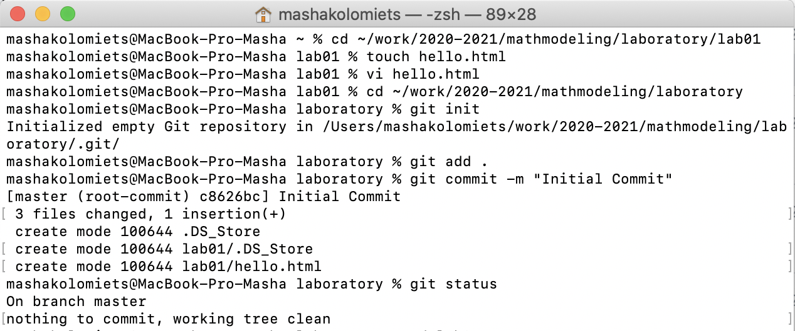
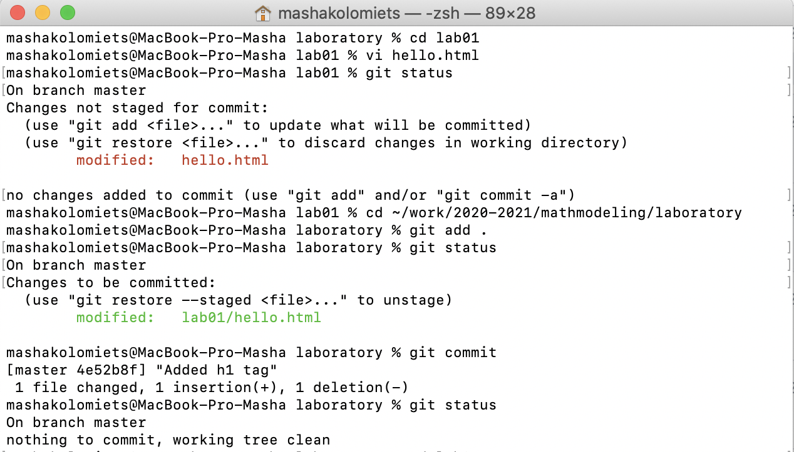
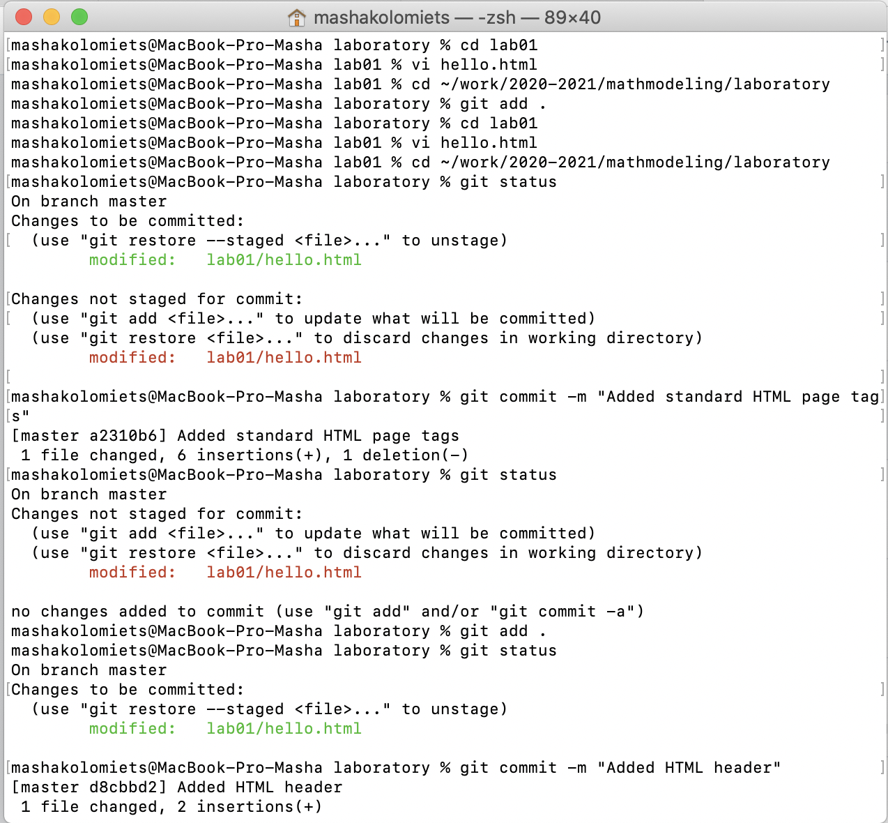
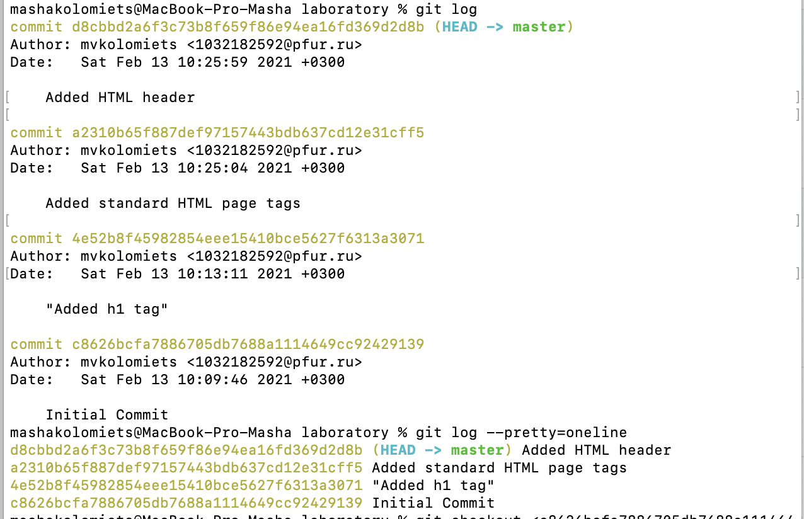
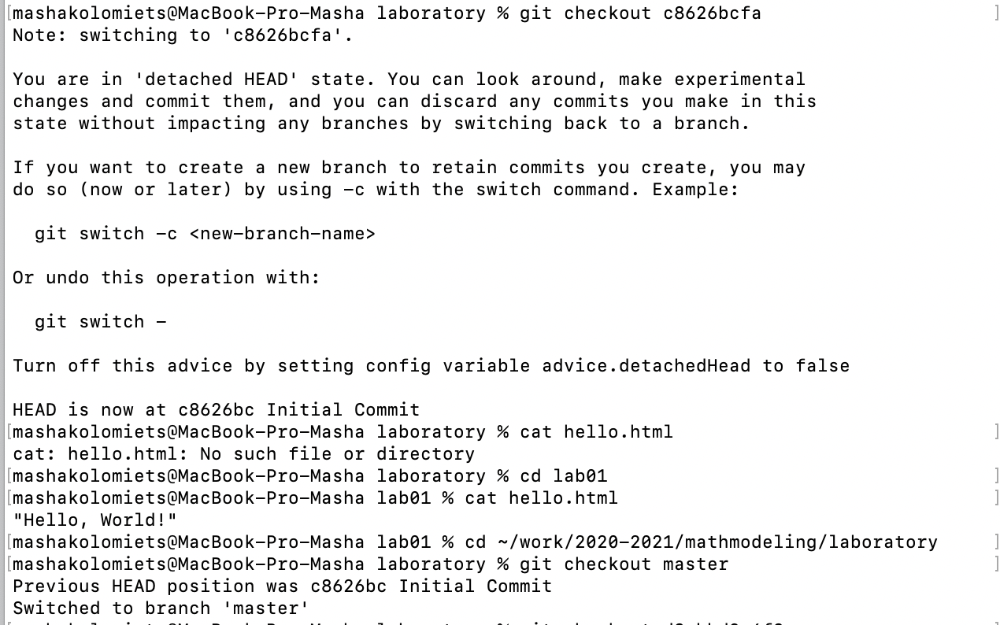
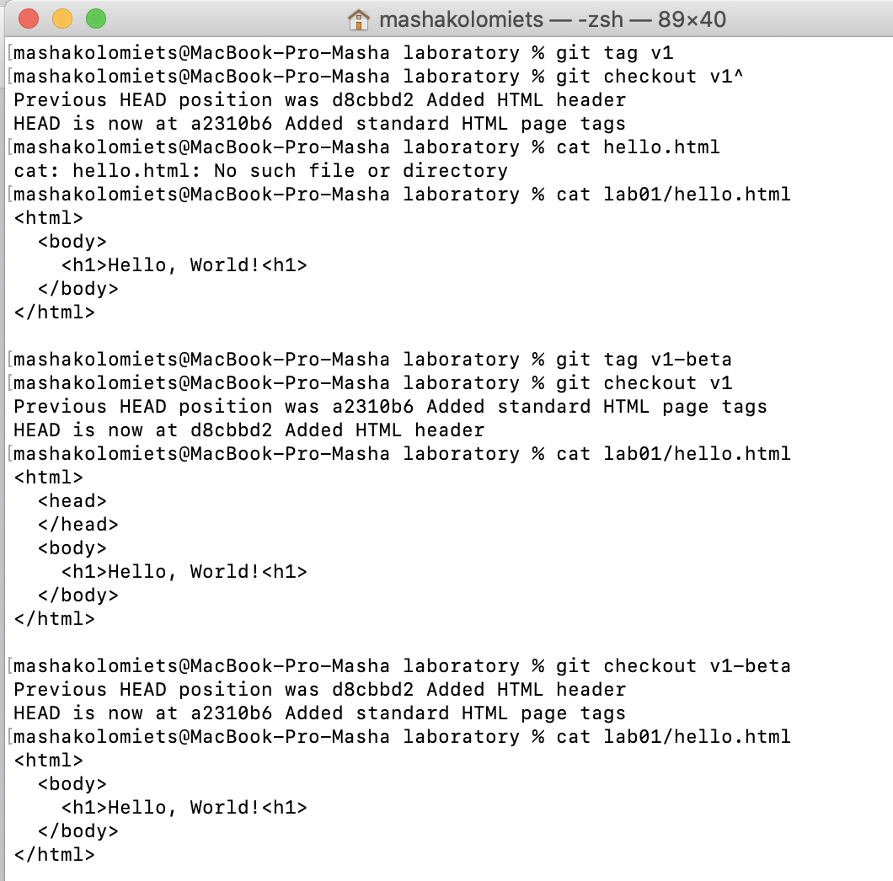
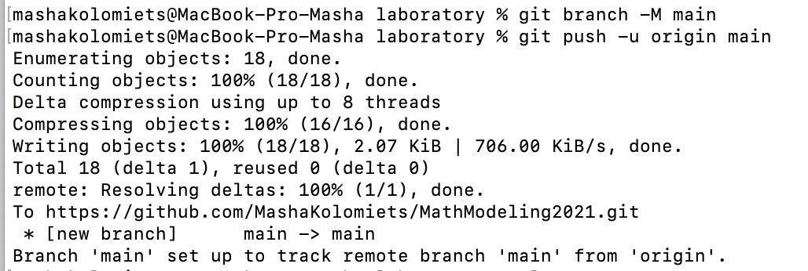
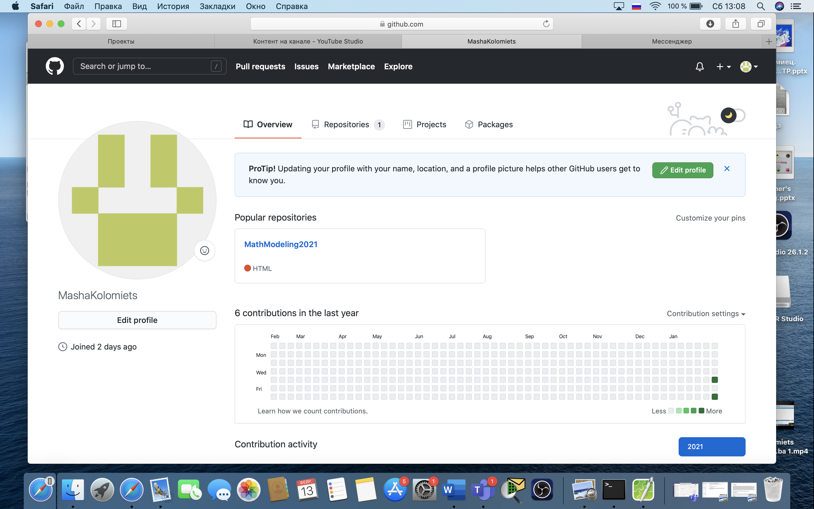

---
# Front matter
lang: ru-RU
title: "Лабораторная работа №1"
subtitle: "Изучение git и markdown"
author: "Коломиец Мария Владимировна, 1032182592, НПИбд-01-18"

# Formatting
toc-title: "Содержание"
toc: true # Table of contents
toc_depth: 2
lof: true # List of figures
lot: true # List of tables
fontsize: 12pt
linestretch: 1.5
papersize: a4paper
documentclass: scrreprt
polyglossia-lang: russian
polyglossia-otherlangs: english
mainfont: PT Serif
romanfont: PT Serif
sansfont: PT Sans
monofont: PT Mono
mainfontoptions: Ligatures=TeX
romanfontoptions: Ligatures=TeX
sansfontoptions: Ligatures=TeX,Scale=MatchLowercase
monofontoptions: Scale=MatchLowercase
indent: true
pdf-engine: lualatex
header-includes:
  - \linepenalty=10 # the penalty added to the badness of each line within a paragraph (no associated penalty node) Increasing the value makes tex try to have fewer lines in the paragraph.
  - \interlinepenalty=0 # value of the penalty (node) added after each line of a paragraph.
  - \hyphenpenalty=50 # the penalty for line breaking at an automatically inserted hyphen
  - \exhyphenpenalty=50 # the penalty for line breaking at an explicit hyphen
  - \binoppenalty=700 # the penalty for breaking a line at a binary operator
  - \relpenalty=500 # the penalty for breaking a line at a relation
  - \clubpenalty=150 # extra penalty for breaking after first line of a paragraph
  - \widowpenalty=150 # extra penalty for breaking before last line of a paragraph
  - \displaywidowpenalty=50 # extra penalty for breaking before last line before a display math
  - \brokenpenalty=100 # extra penalty for page breaking after a hyphenated line
  - \predisplaypenalty=10000 # penalty for breaking before a display
  - \postdisplaypenalty=0 # penalty for breaking after a display
  - \floatingpenalty = 20000 # penalty for splitting an insertion (can only be split footnote in standard LaTeX)
  - \raggedbottom # or \flushbottom
  - \usepackage{float} # keep figures where there are in the text
  - \floatplacement{figure}{H} # keep figures where there are in the text
---

# Цель работы

Цель работы --- вспомнить как работать с  git и markdown, подготовить рабочее пространство для последующих лабораторных работ.

# Задание

1. Установить git и ознакомиться с основными возможностями.
2. Выполнить отчет в формате Markdown.
3. Выполнить презентацию по лабораторной работе в Markdown.

# Выполнение лабораторной работы

1. Вспомнила принципы работы с git.
Основные команды:

-**git init**  
Создает новый проект

-**git add**  
Добавляет содержимое рабочей директории в индекс (staging area) для последующего коммита.

-**git status**  
Показывает состояния файлов в рабочей директории и индексе: какие файлы изменены, но не добавлены в индекс; какие ожидают коммита в индексе. 

-**git commit**  
Берёт все данные, добавленные в индекс с помощью git add, и сохраняет их слепок во внутренней базе данных, а затем сдвигает указатель текущей ветки на этот слепок.

-**git reset**  
Используется в основном для отмены изменений. Она изменяет указатель HEAD и, опционально, состояние индекса.

-**git clone**  
Клонирует удаленный репозиторий

2. Вошла в созданное мной рабочее пространство ~/work/2020-2021/mathmodeling/laboratory/lab01 и создала там файл с именем hello.html. Затем создала репозиторий, добавила в него созданный файл и проверила состояние репозитория. (рис. -@fig:001)

{ #fig:001 width=70% } 

3. Добавила HTML-теги к нашему приветствию, изменив содержимое файла hello.html и проверила состояние рабочего каталога. Затем выполнила команду git add . чтобы проиндексировать изменения и мнова проверила состояние. Сделала коммит изменений и проверила состояние. (рис. -@fig:002)

{ #fig:002 width=70% }
 
4. Изменила файл hello.html, чтобы он содержал стандартные теги <html> и <body>. Затем добавила это изменение в индекс git. Далее добавила заголовки HTML (секцию <head>) к файлу и проверила текущий статус. Произвела коммит проиндексированного изменения, а затем еще раз проверила состояние. Добавила второе изменение в индекс, а затем проверила состояние с помощью командыgit status. Сделала коммит второго изменения. (рис. -@fig:003)

{ #fig:003 width=70% } 

5. Просмотрела список произведенных изменений, затем просмотрела однострочный формат истории. (рис. -@fig:004)

{ #fig:004 width=70% } 

6. Изучив данные лога и найдя хэш для первого коммита, использовала его для возвращения назад в историю с помощью команды git checkout <hash>, затем проверила содержимое файла hello.html. Вернулась к последней версии в ветке master. (рис. -@fig:005)

{ #fig:005 width=70% } 

7. Создала тег первой версии. Переключилась на предыдущую версию и просмотрела содержимое файла hello.html. Версию с тегами <head> сделала версией v1-beta. Затем с помощью git checkout попереключалась между двумя отмеченными версиями, проверяя содержимое файла hello.html (рис. -@fig:006)

{ #fig:006 width=70% } 

8. Созданный мной файл добавила в репозиторий на Github. (рис. -@fig:007), (рис. -@fig:008)

{ #fig:007 width=70% } 

{ #fig:008 width=70% } 

# Вывод

На основе проделанной работы вспомнила как работать с  git и markdown, подготовила рабочее пространство для последующих лабораторных работ.
