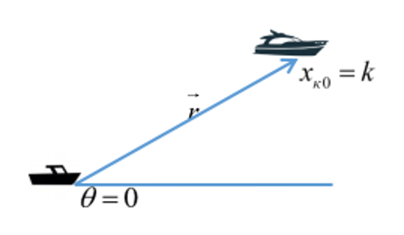
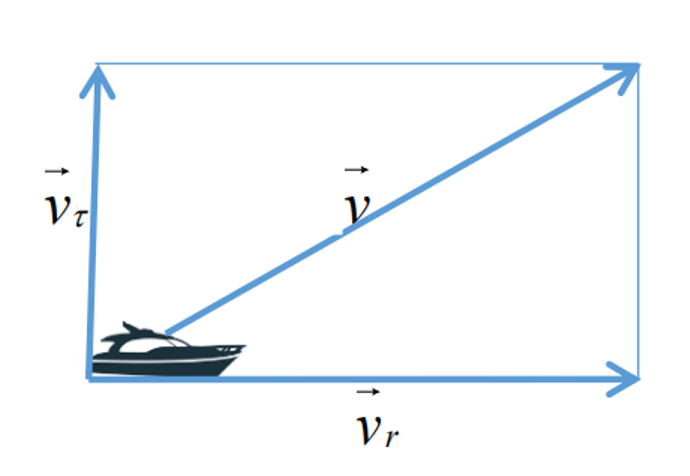
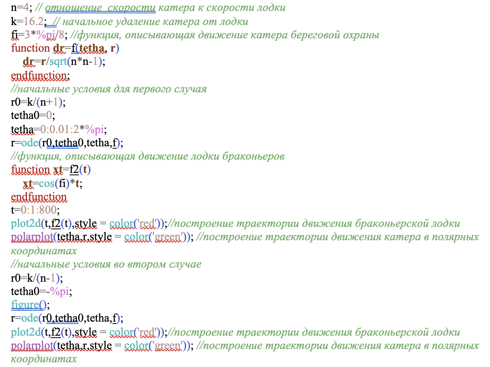
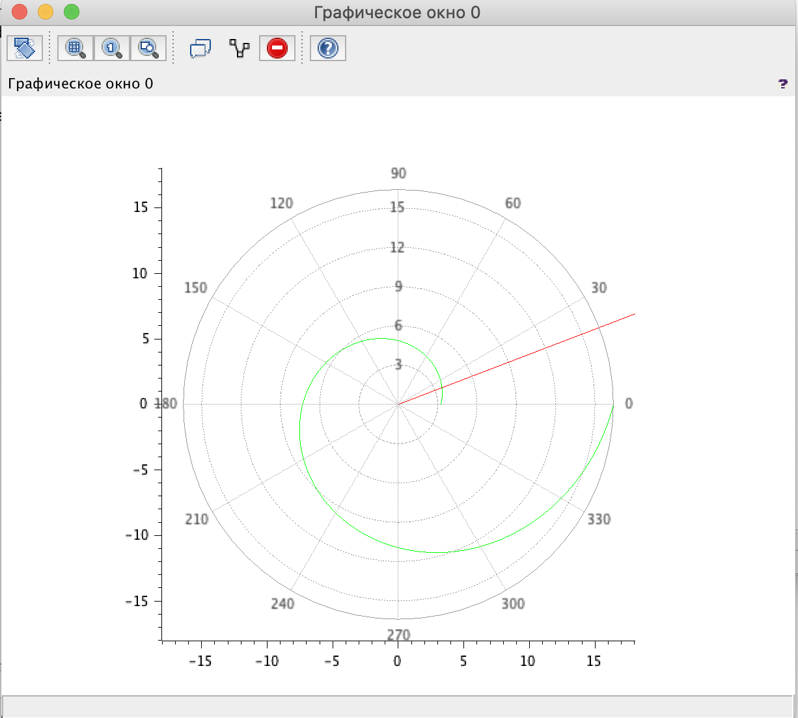
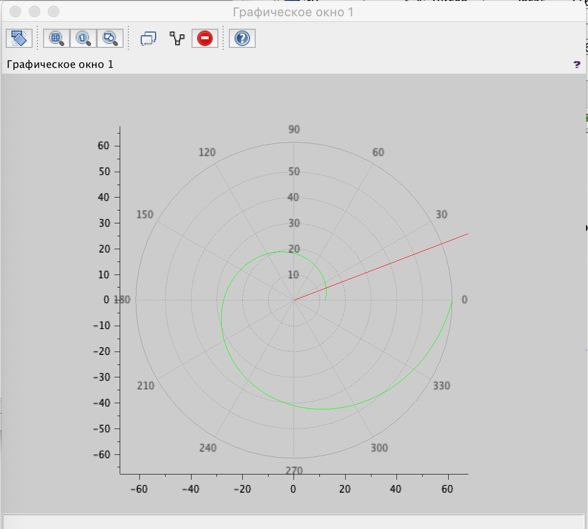

---
# Front matter
lang: ru-RU
title: "Лабораторная работа №2"
subtitle: "Решение задачи о погоне"
author: "Коломиец Мария Владимировна, 1032182592, НПИбд-01-18"

# Formatting
toc-title: "Содержание"
toc: true # Table of contents
toc_depth: 2
lof: true # List of figures
lot: true # List of tables
fontsize: 12pt
linestretch: 1.5
papersize: a4paper
documentclass: scrreprt
polyglossia-lang: russian
polyglossia-otherlangs: english
mainfont: PT Serif
romanfont: PT Serif
sansfont: PT Sans
monofont: PT Mono
mainfontoptions: Ligatures=TeX
romanfontoptions: Ligatures=TeX
sansfontoptions: Ligatures=TeX,Scale=MatchLowercase
monofontoptions: Scale=MatchLowercase
indent: true
pdf-engine: lualatex
header-includes:
  - \linepenalty=10 # the penalty added to the badness of each line within a paragraph (no associated penalty node) Increasing the value makes tex try to have fewer lines in the paragraph.
  - \interlinepenalty=0 # value of the penalty (node) added after each line of a paragraph.
  - \hyphenpenalty=50 # the penalty for line breaking at an automatically inserted hyphen
  - \exhyphenpenalty=50 # the penalty for line breaking at an explicit hyphen
  - \binoppenalty=700 # the penalty for breaking a line at a binary operator
  - \relpenalty=500 # the penalty for breaking a line at a relation
  - \clubpenalty=150 # extra penalty for breaking after first line of a paragraph
  - \widowpenalty=150 # extra penalty for breaking before last line of a paragraph
  - \displaywidowpenalty=50 # extra penalty for breaking before last line before a display math
  - \brokenpenalty=100 # extra penalty for page breaking after a hyphenated line
  - \predisplaypenalty=10000 # penalty for breaking before a display
  - \postdisplaypenalty=0 # penalty for breaking after a display
  - \floatingpenalty = 20000 # penalty for splitting an insertion (can only be split footnote in standard LaTeX)
  - \raggedbottom # or \flushbottom
  - \usepackage{float} # keep figures where there are in the text
  - \floatplacement{figure}{H} # keep figures where there are in the text
---

# Цель работы

Цель работы --- построить математическую модель для выбора правильной стратегии при решении задач поиска.

# Задание

Вариант 43:

На море в тумане катер береговой охраны преследует лодку браконьеров. Через определенный промежуток времени туман рассеивается, и лодка обнаруживается на расстоянии 16,2 км от катера. Затем лодка снова скрывается в тумане и уходит прямолинейно в неизвестном направлении. Известно, что скорость катера в 4 раза больше скорости браконьерской лодки.
1. Запишите уравнение, описывающее движение катера, с начальными условиями для двух случаев (в зависимости от расположения катера относительно лодки в начальный момент времени).
2. Постройте траекторию движения катера и лодки для двух случаев.
3. Найдите точку пересечения траектории катера и лодки

# Выполнение лабораторной работы

Обозначаем как t~0~ = 0, X~л0~ = 0 - место нахождения лодки браконьеров в момент обнаружения, соответственно, X~к0~ = k - место нахождения катера береговой охраны относительно лодки браконьеров в момент обнаружения лодки.
Введем полярные координаты. Считаем, что полюс - это точка обнаружения лодки браконьеров x~л0~ ($\ θ = \ x_л0 = 0$), а полярная ось r проходит через точку нахождения катера береговой охраны. (рис. -@fig:001)

{ #fig:001 width=70% } 

Траектория катера должна быть такой, чтобы и катер, и лодка все время были на одном расстоянии от полюса $\ θ$, только в этом случае траектория катера пересечется с траекторией лодки. Поэтому для начала катер береговой охраны должен двигаться некоторое время прямолинейно, пока не окажется на том же расстоянии от полюса, что и лодка браконьеров. После этого катер береговой охраны должен двигаться вокруг полюса удаляясь от него с той же скоростью, что и лодка браконьеров. Таким образом, полагаем два случая $\ θ = 0$ и $\ θ = -π$.

Чтобы найти расстояние x (расстояние после которого катер начнет двигаться вокруг полюса), необходимо составить уравнение. Пусть через время t катер и лодка окажутся на одном расстоянии x от полюса. За это время лодка пройдет x, а катер x-k (или x+k во втором случае, в зависимости от начального положения катера относительно полюса). Время, за которое они пройдут это расстояние, вычисляется как $\ x/υ$ для лодки и для катера $\ (x+k)/ \ nυ$ (во втором случае $\ (x-k)/ \ nυ$. Так как время одно и то же, то эти величины одинаковы. Тогда неизвестное расстояние можно найти из следующего уравнения: $\ x/ \ υ = \ (x+k)/ \ nυ$ - в первом случае, и $\ x/ \ υ=\ (x-k)/ \ nυ$ во втором случае.
Из каждого уравнения мы найдем два значения x~1~ и x~2~, задачу будем решать для двух случаев. Таких
$\ x_1 =  \ k/\ (n+1)$, при  $\ θ = 0$
$\ x_2 = \ k/ \ (n-1)$ , при $\ θ = - π$

После того, как катер береговой охраны окажется на одном расстоянии от полюса, что и лодка, он должен сменить прямолинейную траекторию и начать двигаться вокруг полюса удаляясь от него со скоростью лодки $\ υ$. Для этого скорость катера раскладываем на две составляющие: $\ υ_r$ - радиальная скорость и $\ υ_t$ - тангенциальная скорость. Радиальная скорость - это скорость, с которой катер удаляется от полюса $\ υ_r = \ dr/\ dt$. Нам нужно, чтобы эта скорость была равна скорости лодки, поэтому полагаем $\ υ = \ dr/\ dt$.

Тангенциальная скорость – это линейная скорость вращения катера относительно полюса. Она равна произведению угловой скорости $\ dθ/\ dt$  на радиус r, $\ υ_r = \ dθ/\ dt \ r$
Найдем тангенциальную скорость для нашей задачи $\ v_τ = \ r \ dθ/ \ dt$. (рис. -@fig:002)

{ #fig:002 width=70% } 

Из рисунка видно: $\ v_τ = \ √(n^2 v_r^2-v^2 )$. Поскольку, радиальная скорость равна $\ υ$, то тангенциальную скорость находим из уравнения $\ v_τ = \ √(n^2 v^2-v^2 )$. Следовательно, $\ v_τ = \ υ√(n^2-1)$.
Тогда получаем $\ r* \ dθ/\ dt = \ v√(n^2-1)$

Решение исходной задачи сводится к решению системы из двух дифференциальных уравнений 
{$\ (dr/ \ dt = v$ ; $\ r * \ dθ/ \ dt = \ v√(n^2-1))$,  с начальными условиями 
{$\ (\ θ_0 = 0  \ r_0 = \ k/(n+1))$	и	{$\ (\ θ_0 = -π$  $\ r_0= \ k/(n-1))$

Исключая из полученной системы производную по t, можно перейти к следующему уравнению:
$\ dr/\ d\ θ = \  r/\ √(n^2-1)$
Решив это уравнение, мы получим траекторию движения катера в полярных координатах.

Используем начальные значения n = 4, $\ θ = 0$ (движение катера по часовой стрелке),  $\ r_0 =  \ k/\ (n+1)$, k = 16,2. 
Тогда имеем{$\ (\ θ_0 = 0$ ; $\ r_0 = \ 16,2/\ (4+1))$
Второй случай,  $\ θ=-π$ (движение катера против часовой стрелки),  $\ r_0 =  \ k/\ (n-1)$,
Система принимает вид  {$\ (\ θ_0=\ -π$; $\ r_0 = \ 16,2/\ (4-1))$

Код программы для решения задачи: (рис. -@fig:003)

{ #fig:003 width=70% } 

Результат работы программы: (рис. -@fig:004) (рис. -@fig:005)

{ #fig:004 width=70% } 

Точка пересечения красного и зеленого графиков - точка пересечения катера и лодки, исходя из графика, имеет параметры $\ θ=25$ $\ r= 3,4$

{ #fig:005 width=70% } 

Точка пересечения красного и зеленого графиков - точка пересечения катера и лодки, исходя из графика, имеет параметры $\ θ=25$ $\ r=11$ 
Наблюдаем, что при погоне «по часовой стрелке» для достижения цели потребуется пройти значительно меньшее расстояние. 

# Вывод

На основе проделанной работы построила математическую модель для выбора правильной стратегии при решении задач поиска. 

